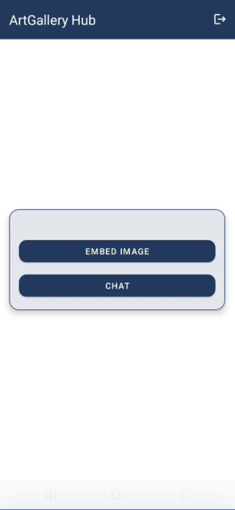

# ArtGallery Android App  

**ArtGallery** is an Android application that integrates **steganography, encryption,** and **gesture-based unlocking mechanisms** to provide a **secure chat experience.** Users can **embed hidden messages into images**, unlock chat features via **QR scanning,** and decrypt messages through a **secret gesture combined with system conditions** (brightness, volume, and ambient noise).  

---

## 🔥 Features  

### 🔹 **Secure Chat with Image-Based Encryption**  
- Messages are **encrypted** and then **embedded** into images before being sent.  
- Messages are stored in **Firebase Realtime Database** as encoded images.  
- A **hidden gesture unlocks decryption** (Double-Tap + Long-Press above the Send button).  
- Decryption mode is **only enabled under specific system conditions** (brightness, volume, and noise levels).  

### 🔹 **Image-Based Steganography**  
- Users can **embed secret messages** into images.  
- Messages are **encrypted before embedding** for added security.  
- Extract hidden messages from images through **decryption processing**.  
- Download steganographic images for storage or sharing.  

### 🔹 **Secret QR Code Unlock Mechanism**  
- Chat and encryption features remain **locked** until a **QR code** is scanned.  
- The **correct QR code** enables access to secure messaging.  

---

## 🚀 How It Works  

### 🔐 **Encryption & Steganography Workflow**  

1. **User enters a message** → App **encrypts it** using a **hybrid encryption system** combining **AES (CBC mode, 128-bit key)** and **RSA encryption**.  
2. The encrypted message is **converted into a Base64 string** to ensure compatibility for embedding.  
3. The Base64 string is **embedded into an image** using **LSB (Least Significant Bit) steganography**, modifying pixel values slightly so that the change is imperceptible to the human eye.  
4. The modified image containing the encrypted message is sent and stored in **Firebase Realtime Database**.  
5. The recipient downloads the image and attempts to **decrypt the hidden message**.  
6. To reveal the hidden message, the recipient must perform the **hidden gesture (Double-Tap + Long-Press above the Send button)**.  
7. The app verifies the **system conditions** (brightness, volume, and noise levels). If conditions are met:  
   - The **LSB decoding algorithm extracts the Base64-encoded encrypted message** from the image.  
   - The extracted data is **decrypted using the recipient's private key**.  
   - The original message is displayed to the user.  
8. If the **conditions are not met**, decryption is **blocked**, keeping the message unreadable.  

### ✋ **Hidden Gesture to Unlock Decryption**  

- Users must **double-tap and long-press** **above the Send button**.  
- **Decryption only works when:**  
  - **Brightness ≥ 80%**  
  - **Volume ≤ 20%**  
  - **Environment is quiet (detected via microphone noise analysis).**  
- If the conditions are not met, the message remains encrypted.  

### 👁 **Secret QR Unlock for Chat Features**  

- Initially, the chat and embedding features are **locked**.  
- Users must **scan a specific QR code** (e.g., `"ArtGallery"`) to **unlock** chat and encryption tools.  
- If an invalid QR code is scanned, the features remain locked.  

---

## 📲 Installation & Setup  

### 1⃣ **Clone the Repository**  

```bash
git clone https://github.com/yourusername/ArtGallery.git
cd ArtGallery
```

### 2⃣ **Open in Android Studio**  
- Launch **Android Studio** and open the project.  
- Ensure that **Google Play Services & Firebase SDKs** are installed.  

### 3⃣ **Firebase Setup**  
1. **Create a Firebase Project** at [Firebase Console](https://console.firebase.google.com/).  
2. Enable **Firebase Realtime Database** and set appropriate rules.  
3. Download your `google-services.json` file and place it in `app/` directory.  
4. Ensure Firebase dependencies are added to `build.gradle`.  

### 4⃣ **Build & Run**  
- Connect a **physical Android device** or use an **emulator** (API 28+ recommended).  
- Click **Run** in Android Studio or use:  

```bash
./gradlew installDebug
```

---

## 📸 Screenshots & Demo  

### Screenshots  
<table>
  <tr>
    <td></td>
    <td></td>
    <td></td>
  </tr>
  <tr>
    <td></td> 
    <td></td>
    <td></td>
  </tr>
</table>


### Demo Video  
[[link](https://youtube.com/shorts/4fw0BO_EWiI?feature=share)]  

---

## 🛠 Technologies Used  

- **Android SDK** (Java)  
- **Firebase Realtime Database**  
- **Steganography (LSB Encoding)**  
- **AES Encryption (CBC Mode, 128-bit keys) + RSA Encryption**  
- **Gesture Detection (Double-Tap + Long-Press above Send button)**  

---

## 🛑 Security Considerations  

- Messages are **AES encrypted** before embedding into images.  
- QR unlock prevents **unauthorized access** to chat features.  
- Decryption is only possible under **specific conditions**.  

---

## 📄 License  

This project is licensed under the **MIT License**.  

---

## 👯‍👨 Contributing  

1. **Fork the repository**  
2. **Create a new branch** (`feature-xyz`)  
3. **Submit a pull request**  

---

## 🌍 Connect  

**Your Name**  
📧 Email: your@email.com  
🎡 GitHub: [yourusername](https://github.com/yourusername)  

